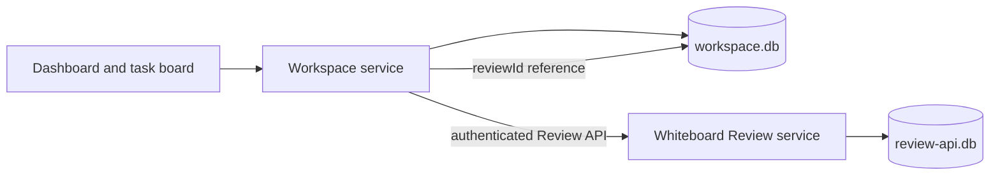

# Architecture: Whiteboard shell and workspace data

Status: the product foundation and data ownership in this section were selected by the user on 2026-09-26. This is a design contract, not an implementation status report.

## Product foundation

- Fork the Whiteboard Code OSS desktop shell and retain its review capability. The new project dashboard uses the general light/dark theme principles of posco-mds. Bugfixer supplies product concepts, not copied private source or operational data.
- Deliver macOS first. Windows x86 follows after the macOS path is working; its exact CPU target is still open.
- The existing Review source navigator is a separate, default read-only workspace window. It is not the editable project mode this product needs. The project window, dashboard, editor, and review-tab integration are the next design section.

## Selected data boundary: app-owned workspace database

The desktop app owns one local SQLite `workspace.db` inside its application profile. Whiteboard continues to own its existing `review-api.db`. The workspace database is available without Docker; Docker is reserved for project execution and test environments where configured.

The workspace service is the only writer of `workspace.db`; renderer views use a typed application API. It calls the Review service through its supported API and never reads or writes Review tables directly. The desktop app supervises both services and closes their resources on shutdown.

| Data | Authority | Stored link or identity |
| --- | --- | --- |
| Project, local checkout binding, task board, agent run and event history | `workspace.db` | App-generated project, checkout, task and run IDs |
| Imported source snapshot, provenance, convention snapshot and E2E artifact metadata | `workspace.db` and app-owned artifact files | Content hash and app-owned IDs; connector and provider credentials stay out of the database |
| Review document, versions, pins, resources and command receipts | Whiteboard `review-api.db` | Review service-generated `reviewId` |
| Task/run to review association | `workspace.db` | Stored returned `reviewId`, plus link state and creation request ID |
| Provider and connector credentials | Separate credential mechanism, to be designed | Opaque account reference in workspace data; no secret values in `workspace.db` |

Every project receives an app-generated UUID that remains stable when its local folder moves. A checkout binding records its current local path and VCS details. Whiteboard's registered `repositoryId` is profile-local and tied to a checkout path; the older JSON `repoKey` used a different path-derived scheme. Neither becomes the project's ID. If a checkout moves, the app retains the project and task history, marks the binding unavailable, and lets the user rebind it. Historical review pins are not silently changed.

## Review-link write contract

1. Save the task and an outgoing review-create request in `workspace.db` before contacting Whiteboard. The request includes a generated `commandId` and the exact Review API command body.
2. Send that command to the authenticated Review API. Whiteboard commits a receipt with the review mutation. If the response is lost, retry the **same** command body and `commandId`; the Review store returns the recorded response instead of creating another review.
3. Store the returned `reviewId` in the task/run link, then mark the outgoing request complete. A pull-request create may return an already existing review; the returned ID is authoritative in either case.
4. To display the review, use the Review API's open operation with the stored ID. On startup, retry pending requests. If the review has since been deleted or cannot be opened, show an unavailable link with an explicit repair action; do not silently create a replacement.

The two databases have no shared transaction. The durable outgoing request and Whiteboard receipt make a lost response recoverable. A backup must capture both databases using SQLite-aware backup operations, then validate saved review links on restore. Copying only the main SQLite file while WAL is active would be unsafe.

## Minimal first slice

The first implementation slice needs projects, checkout bindings, tasks, outgoing review requests, and review links. These records are enough to prove project selection, a task created on the board, and a task-linked review. The next slice adds runs and run events together with a real agent dispatch path, so the board never presents an inert run as a working agent. Reference snapshots, conventions, connectors, and E2E evidence extend this same app-owned model in later slices; they do not move into Whiteboard's review store.

The slice is accepted only when:

1. A project and task remain visible after app restart without Docker running.
2. A task creates or reuses a review, stores the returned `reviewId`, opens it through the Review API, and recovers the same link after a simulated lost response using its saved `commandId`.
3. Moving a local checkout keeps the project's UUID and task history; a missing checkout or deleted review is visible to the user.
4. A backup/restore of both stores retains valid links and identifies any missing review. The public repository contains no private Bugfixer source or operational data, and `workspace.db` contains no provider credentials.

## Next design boundary

The project-window layout remains to be selected: the current Whiteboard Review window and separate read-only navigator cannot deliver an editable dashboard → file → review tab flow as they stand. That integration will be designed against the native Code OSS workbench and Whiteboard's review editor contributions before implementation.

Source evidence and remaining product decisions are recorded in [discovery.md](discovery.md).
