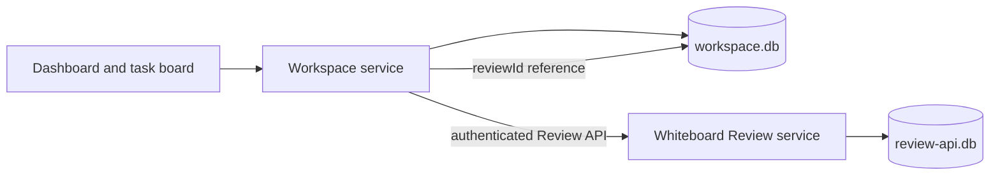

# Architecture: Whiteboard shell and workspace data

Status: the product foundation, workspace data boundary, project-window layout, and one-window-per-project behavior in this document were selected by the user on 2026-09-26. This is a design contract, not an implementation status report.

## Product foundation

- Fork the Whiteboard Code OSS desktop shell and retain its review capability. The new project dashboard uses the general light/dark theme principles of posco-mds. Bugfixer supplies product concepts, not copied private source or operational data.
- Deliver macOS first. Windows x86 follows after the macOS path is working; its exact CPU target is still open.
- The existing Review source navigator is a separate, default read-only workspace window. It is not the editable project mode this product needs.

## Selected project window: native editor with dashboard and review tabs

Open an actual project checkout in a native Code OSS project window. Put the MDS-themed dashboard, editable project files, and Whiteboard review canvas in that window's editor tabs. The project dashboard is the first useful tab; opening a task's file or review retains its task context and returns to the same dashboard. The Review source navigator remains read-only for pinned historical sources. The window stores an active task ID separately from a file URI or review ID: opening the same file from two tasks changes the visible task context explicitly, and restart restores the last selected task without treating a shared file tab as belonging to both tasks.

Each editable native window belongs to one project UUID and its active checkout. The project switcher focuses that project's existing window or opens a new one; it never replaces a window's checkout while its files are open. A main-process window registry binds project ID to window ID, and all task/file/review dispatch verifies that binding. Closing a window saves its tabs, selected task, and dashboard position for that project. Relaunch restores the project windows that were open at quit; a missing checkout shows **Rebind folder** in its own window without loading another project's files. This is the user's selected multi-project option A.

The current entry selection loads `navigator.desktop.main` for a workspace and `review.desktop.main` for an empty window. Project mode therefore needs an explicit boot path distinct from the Review-owned navigator workspace. It must open the user's real checkout without the navigator's `files.readonlyInclude` setting. Whiteboard already registers its canvas as a Code OSS editor pane; its Review-only service initialization and automatic Home tab need to be separated so the review editor can open in a project workbench without replacing the dashboard.

An in-app task click opens its stored `reviewId` through the project window's review editor service. The existing HTTP `POST /reviews-api/:id/open` dispatches to Whiteboard's attached desktop control; it does not yet prove that an active project tab will open. External review-open requests need project-aware routing, or an explicit project choice when the review is not linked. They must not silently send a task-linked review to an unrelated window.

The first UI proof opens two macOS project windows with different checkouts. In one, edit and save a file, create or select a task on the dashboard, open its Whiteboard review in another tab of the **same** window, and return to the dashboard. Switch to the other project and back without moving either project's tabs or active task. Restart with both windows, tabs, and task selections restored. Open the same file from a second task in one project and confirm the task context changes without misattributing either task. Confirm separately that pinned review-source navigation stays read-only.

## Selected data boundary: app-owned workspace database

The desktop app owns one local SQLite `workspace.db` inside its application profile. Whiteboard continues to own its existing `review-api.db`. The workspace database is available without Docker; Docker is reserved for project execution and test environments where configured.

The app main process owns the workspace service and is the only writer of `workspace.db`; renderer views use a typed application API. It calls Whiteboard through its supported Review API and never reads or writes Review tables directly. Whiteboard's existing main-process supervisor owns the Review server utility process; the app main process closes its own workspace connection and coordinates shutdown with that supervisor. The Review server's local URL and token are private process capabilities, never task data or renderer-visible settings.

| Data | Authority | Stored link or identity |
| --- | --- | --- |
| Project, local checkout binding, task board, agent run and event history | `workspace.db` | App-generated project, checkout, task and run IDs |
| Imported source snapshot, provenance, convention snapshot and E2E artifact metadata | `workspace.db` and app-owned artifact files | Content hash and app-owned IDs; connector and provider credentials stay out of the database |
| Review document, versions, pins, resources and command receipts | Whiteboard `review-api.db` | Review service-generated `reviewId` |
| Task/run to review association | `workspace.db` | Stored returned `reviewId`, plus link state and creation request ID |
| Provider and connector credentials | Separate credential mechanism, to be designed | Opaque account reference in workspace data; no secret values in `workspace.db` |

Every project receives an app-generated UUID that remains stable when its local folder moves. A checkout binding records its current local path and VCS details. Whiteboard's registered `repositoryId` is profile-local and tied to a checkout path; the older JSON `repoKey` used a different path-derived scheme. Neither becomes the project's ID. The app registers an available Git/jj checkout through `POST /reviews-api/repositories {path}`; Whiteboard resolves the VCS root and returns `{id,name}`, so the app stores `response.id` as the binding's Review `repositoryId` before creating a task review. If a checkout moves, the app retains the project and task history, marks the binding unavailable, and lets the user rebind it. Rebinding registers the new path; historical review pins are not silently changed.

## Review-link write contract

1. The user chooses **Create review** on a task bound to an available, registered Git/jj checkout. Save the task and outgoing Review API request in `workspace.db` before the create call. Its stable UUID `commandId` and exact body include `operation: {type:"create", title:<task title>, target:{kind:"worktree",repositoryId:<registered ID>}, open:false}`. Title-only create is invalid. The worktree target follows saved staged, unstaged, and nonignored untracked files; without a base it compares against current HEAD, including an empty diff on a clean checkout. A later task rename does not silently rename the review.
2. Send that request to the authenticated Review API using the private local capability held by the app main process. `open:false` suppresses the API's automatic opening in its attached Desktop; it is a presentation option stripped before Whiteboard stores the command receipt. If the response is lost, retry the **same** body and `commandId`; the Review store returns the recorded response instead of creating another review.
3. Store the returned `reviewId` in the task/run link, then mark the outgoing request complete. A later click opens this stored link instead of creating another review. If a task explicitly starts from a pull request, its separate create command may reuse an existing review for that PR; the returned ID is authoritative in either case. The Review document does not acquire the task description or agent findings automatically; authoring those requires explicit Review edit commands.
4. Resolve the owning project window from the task's project ID and ask **that window's** workbench review-tab service to open the stored `reviewId`. If the window is closed, open or focus the correct project window before dispatch. Whiteboard's current `POST /reviews-api/:id/open` reaches the server-attached Desktop without a project target, so it cannot prove same-window routing by itself. External Review API open requests need project-aware routing or an explicit project choice. On startup, retry pending create requests. If the review has since been deleted or cannot be opened, show an unavailable link with an explicit repair action; do not silently create a replacement.

The two databases have no shared transaction. The durable outgoing request and Whiteboard receipt make a lost response recoverable. The first-slice restore proof uses a disposable profile and SQLite-aware backup operations for both stores, then validates saved review links; it is a test fixture, not a user-facing backup feature. Copying only the main SQLite file while WAL is active would be unsafe.

## Selected conventions: app-authored project document

Each project has a human-readable, versioned convention document in `workspace.db`. The app is its source of truth; a repository file is not required. People can edit the document in project settings and export it as Markdown. The document is organized for reading: each rule has a clear statement, reason, good and avoided examples, applicable work type, and linked sources. Examples generated for explanation are labeled as examples rather than presented as quotes from a source.

The app generates draft documents from reference material through this flow:

1. The user starts from source snapshots imported through Slack, Notion, websites, or another installed connector. An agent may propose a relevant set; the final input list, origin, and retrieval time remain visible before drafting.
2. A drafting agent writes a **draft** with a source link for every source-derived rule and readable examples. The imported material is still reference data at this point, not an agent instruction.
3. A separate checking run compares the draft with the selected sources, flags unsupported claims, contradictions, duplicated rules, sensitive material, and examples that appear to be factual quotes without evidence. It records findings with rule and source references. This agent check informs the user; it does not approve the document.
4. The project settings show the complete document, examples, sources, checker findings, and a diff from the active version. The user can edit and explicitly **Apply** a reviewed version. Only that action makes the version available as project instructions. A later source refresh proposes an update rather than silently rewriting the active version.
5. At each agent launch, the app captures the active version, rendered instruction text, source/version IDs, ordering, content hash, and provider delivery path in a run snapshot. The run view shows the same text. No applied convention is a valid empty payload with a null version; a selected version whose required content is missing or invalid is an explicit preflight error.

The provider adapter must account for any instructions the underlying CLI loads on its own, so the app does not blindly send the same rule twice. If an adapter cannot establish the effective instruction set, the UI reports that limitation instead of claiming that the preview is complete. Imported reference text is never promoted to instructions by merely appearing in a task or connector result.

This design reuses only the Bugfixer concept that the visible rules and injected rules must agree. It does not copy private convention text, paths, snapshots, or the old redaction implementation. Credential masking by itself would not remove organization-specific instructions from a private document.

The convention flow is accepted only when a selected reference set produces a draft while the active version stays unchanged; an independent check surfaces a contradictory or unsupported rule; the user can read its reasons, examples, and linked sources before applying; and the next real agent run records the exact applied version and payload. Exported Markdown must retain the readable structure and source labels.

## Task board and run lifecycle

The dashboard shows each project's next useful action and a compact board: **Ready**, **In progress**, **Review**, and **Done**. A task owns its title, description, project/checkout binding, board state, reference links, run history, reviews, and E2E evidence. A task's state is separate from its agent run state: a successful run can suggest review but never silently mark the task Done. Opening a task keeps these details in one place; editor and review tabs return to that task. The dashboard suggests one next action by priority: an agent waiting for the user's input, a task awaiting review, a running task to inspect, then an executable Ready task. Ties use the oldest waiting item first so a restart shows the same choice.

A run has an immutable launch record: task ID, target checkout, provider and selected account ID, model/role, applied convention snapshot or explicit null version, selected reference snapshot IDs, any user-approved reference text promoted to a task instruction, tool permissions, and its parent run ID if it is a subagent. The app writes this record before starting a provider process. Events and result artifacts append to the run; retrying creates a new run linked to the failed attempt instead of overwriting its history. Queue, preflight, running, waiting for input, succeeded, failed, cancelled, and interrupted are distinct states. Preflight reports a missing checkout, unavailable account, invalid selected convention version, or unavailable execution environment before a process starts.

App-owned subagents are child runs with their own scope, provider/account choice, status, and result under the parent task. A provider's internal helper is not shown as an independently managed subagent unless its adapter exposes verifiable lifecycle events. Each child receives only the selected task context and reference snapshots. The board can show concurrent read-only research, while a checkout admits one mutating agent run at a time; a second mutating run waits with an explicit reason. The scheduler keys the writer lock by the canonical on-disk worktree identity, not the app's checkout-binding ID or a typed path. It takes a host-wide lock before committing a queued run's transition to execution, releases it if that transition fails, and holds it through process cleanup; startup reconciles stale lock ownership before dispatch. Two paths or app bindings for the same worktree must serialize, including after restart.

The supervisor records the process identity and resources started for a run. Cancellation stops that run's process tree and its owned execution resources, then records the cleanup result. On app restart, a run without a verified live process becomes **interrupted** and may be rerun as a new attempt; a bare reused PID is never enough to reattach. Log and artifact storage must exclude provider secrets. The account proof uses two separately authenticated accounts of the **same provider** running at the same time on distinct checkouts, with each run bound to the intended account profile and no change to the other profile's credential state. A provider-reported identity is compared when available; otherwise the UI distinguishes verified profile isolation from an unverified account label. Repeat for each provider mode claimed as supported. The run proof also covers two checkout bindings that point to one worktree, a queued conflicting edit that stays queued after restart, and a child run whose parent link, result, artifact, cancellation state, and cleanup survive restart.

## Imported reference and connector contract

Slack, Notion, and website imports use one app-owned reference model. Each import creates an immutable source snapshot with connector ID/version, source URI or stable external ID, title, retrieval time, content type, content hash, source account reference, and an app-owned content artifact. Reimporting creates a new snapshot linked to the prior one; it never rewrites material already used by a task, convention draft, or run. A task stores exact snapshot IDs so a later source edit cannot change its evidence. Extracted text and summaries are derived artifacts with their own provenance, not replacements for the original snapshot.

First-party and installed connectors implement the same discover/preview/import/refresh contract. A connector declares an API version and the domains, account scopes, and local or browser access it needs; installation and connection display these capabilities before use. The app brokers credential access and writes snapshots through the workspace service. An installed connector may be a limited declarative package interpreted by trusted app code, without executing package code. If executable packages are selected, a separate runner must enforce the declared network, file, browser, and credential boundary and deny direct access to `workspace.db` and the Whiteboard review store. A manifest alone is not enforcement. The first-release package format and any executable sandbox remain user decisions; each selected format needs its own denial proof. [Connector runtime research](connector-runtime.md) compares the boundaries without selecting one.

For websites, a public URL can be fetched with its origin and retrieval time recorded. Capturing a signed-in page requires an explicit user-selected tab or connector authorization; the app must not silently reuse unrelated browser cookies. The same source labeling applies to Slack and Notion objects, including messages, pages, attachments, and thread or parent context where available. Imported text stays reference data even when shown to an agent. If a user promotes an excerpt to a task instruction, the app records the exact approved text, source snapshot ID, approver action, and final delivered instruction in the run snapshot; merely attaching the source never promotes it. Provider prompts mark unapproved source content as quoted reference material.

The connector proof is one Slack item, one Notion page, one website page, and one installed test connector producing the same snapshot shape; after an upstream edit, old task evidence must still display the original bytes and the refresh as a new version. A test connector denied a declared host or account scope must fail to reach that resource. A declarative package must reject executable fields at installation; an executable package, if chosen, additionally needs direct-access denial tests in its isolated runtime. Revoking a connection stops future fetches without silently deleting snapshots that a task already cites; explicit deletion remains a separate user action. The installation format, browser capture path, provider scopes, and platform packaging still require design and source validation.

## Frontend E2E evidence on macOS

A task can request an Ego Lite browser check against an explicit target URL and expected scenario. The task/run record fixes the target, checkout revision, environment identity, scenario steps, and the agent that requested the check before the browser opens. The app owns the browser task-space lifecycle: create a task space and persist its ID, run the scenario, save screenshots plus console/network findings and a pass/fail result, then call `task.finish({ keep: [] })` even when the scenario fails or is cancelled. A cleanup failure is recorded visibly and retried by its owning run supervisor using the saved task-space ID; a missing cleanup confirmation is never displayed as a fully finished check.

E2E evidence links to the exact task, run, target, and artifact hashes in `workspace.db`; images and larger logs remain app-owned artifacts. When a project server runs in Docker, the preflight verifies that the browser on macOS can reach the published target URL. The first proof covers a passing page flow, a page failure with screenshot and console/network evidence, and a cancelled check whose task space is closed. Ego Lite's browser app is macOS-specific today, so this contract does not claim a Windows browser implementation; the later Windows phase needs its own verified adapter.

## Minimal first slice

The first implementation slice needs projects, checkout bindings, tasks, outgoing review requests, and review links. These records are enough to prove project selection, a task created on the board, and a task-linked review. The next slice adds runs and run events together with a real agent dispatch path, so the board never presents an inert run as a working agent. Reference snapshots, conventions, connectors, and E2E evidence extend this same app-owned model in later slices; they do not move into Whiteboard's review store.

The slice is accepted only when:

1. Two projects and their tasks remain visible in separate native windows after app restart without Docker running. Switching focuses the correct window; neither window shows the other's checkout, tabs, or selected task.
2. A task creates or reuses a review through the Review API, stores the returned `reviewId`, opens its canvas in the same native project window, and recovers the same link after a simulated lost response using its saved `commandId`.
3. Moving a local checkout keeps the project's UUID and task history; a missing checkout or deleted review is visible to the user.
4. A backup/restore of both stores retains valid links and identifies any missing review. The public repository contains no private Bugfixer source or operational data, and `workspace.db` contains no provider credentials.

## Next design boundary

Antigravity account scope, connector packaging and browser capture, and Docker execution still need their own contracts. [Provider adapter research](provider-adapters.md) details native instruction loading, prompt delivery, event parsing, and the required account-isolation proof; the app-managed convention lifecycle above is selected.

Source evidence and remaining product decisions are recorded in [discovery.md](discovery.md).
