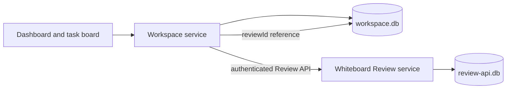

# Architecture: Whiteboard shell and workspace data

Status: the product foundation, workspace data boundary, and project-window layout in this document were selected by the user on 2026-09-26. This is a design contract, not an implementation status report.

## Product foundation

- Fork the Whiteboard Code OSS desktop shell and retain its review capability. The new project dashboard uses the general light/dark theme principles of posco-mds. Bugfixer supplies product concepts, not copied private source or operational data.
- Deliver macOS first. Windows x86 follows after the macOS path is working; its exact CPU target is still open.
- The existing Review source navigator is a separate, default read-only workspace window. It is not the editable project mode this product needs.

## Selected project window: native editor with dashboard and review tabs

Open an actual project checkout in a native Code OSS project window. Put the MDS-themed dashboard, editable project files, and Whiteboard review canvas in that window's editor tabs. The project dashboard is the first useful tab; opening a task's file or review retains its task context and returns to the same dashboard. The Review source navigator remains read-only for pinned historical sources.

The current entry selection loads `navigator.desktop.main` for a workspace and `review.desktop.main` for an empty window. Project mode therefore needs an explicit boot path distinct from the Review-owned navigator workspace. It must open the user's real checkout without the navigator's `files.readonlyInclude` setting. Whiteboard already registers its canvas as a Code OSS editor pane; its Review-only service initialization and automatic Home tab need to be separated so the review editor can open in a project workbench without replacing the dashboard.

An in-app task click opens its stored `reviewId` through the project window's review editor service. The existing HTTP `POST /reviews-api/:id/open` dispatches to Whiteboard's attached desktop control; it does not yet prove that an active project tab will open. External review-open requests need project-aware routing, or an explicit project choice when the review is not linked. They must not silently send a task-linked review to an unrelated window.

The first UI proof is one macOS project flow: open a real checkout, edit and save a file, create or select a task on the dashboard, open its Whiteboard review in another tab of the **same** window, return to the dashboard, and restart with the relevant tabs restored. Confirm separately that pinned review-source navigation stays read-only.

## Selected data boundary: app-owned workspace database

The desktop app owns one local SQLite `workspace.db` inside its application profile. Whiteboard continues to own its existing `review-api.db`. The workspace database is available without Docker; Docker is reserved for project execution and test environments where configured.

The workspace service is the only writer of `workspace.db`; renderer views use a typed application API. It calls the Review service through its supported API and never reads or writes Review tables directly. The desktop app supervises both services and closes their resources on shutdown.

| Data | Authority | Stored link or identity |
| --- | --- | --- |
| Project, local checkout binding, task board, agent run and event history | `workspace.db` | App-generated project, checkout, task and run IDs |
| Imported source snapshot, provenance, convention snapshot and E2E artifact metadata | `workspace.db` and app-owned artifact files | Content hash and app-owned IDs; connector and provider credentials stay out of the database |
| Review document, versions, pins, resources and command receipts | Whiteboard `review-api.db` | Review service-generated `reviewId` |
| Task/run to review association | `workspace.db` | Stored returned `reviewId`, plus link state and creation request ID |
| Provider and connector credentials | Separate credential mechanism, to be designed | Opaque account reference in workspace data; no secret values in `workspace.db` |

Every project receives an app-generated UUID that remains stable when its local folder moves. A checkout binding records its current local path and VCS details. Whiteboard's registered `repositoryId` is profile-local and tied to a checkout path; the older JSON `repoKey` used a different path-derived scheme. Neither becomes the project's ID. If a checkout moves, the app retains the project and task history, marks the binding unavailable, and lets the user rebind it. Historical review pins are not silently changed.

## Review-link write contract

1. Save the task and an outgoing review-create request in `workspace.db` before contacting Whiteboard. The request includes a generated `commandId` and the exact Review API command body.
2. Send that command to the authenticated Review API. Whiteboard commits a receipt with the review mutation. If the response is lost, retry the **same** command body and `commandId`; the Review store returns the recorded response instead of creating another review.
3. Store the returned `reviewId` in the task/run link, then mark the outgoing request complete. A pull-request create may return an already existing review; the returned ID is authoritative in either case.
4. To display the review from a task, use the stored ID to open the Whiteboard review editor in that project's native window. External Review API open requests require the project-aware routing described above. On startup, retry pending requests. If the review has since been deleted or cannot be opened, show an unavailable link with an explicit repair action; do not silently create a replacement.

The two databases have no shared transaction. The durable outgoing request and Whiteboard receipt make a lost response recoverable. A backup must capture both databases using SQLite-aware backup operations, then validate saved review links on restore. Copying only the main SQLite file while WAL is active would be unsafe.

## Selected conventions: app-authored project document

Each project has a human-readable, versioned convention document in `workspace.db`. The app is its source of truth; a repository file is not required. People can edit the document in project settings and export it as Markdown. The document is organized for reading: each rule has a clear statement, reason, good and avoided examples, applicable work type, and linked sources. Examples generated for explanation are labeled as examples rather than presented as quotes from a source.

The app generates draft documents from reference material through this flow:

1. The user starts from source snapshots imported through Slack, Notion, websites, or another installed connector. An agent may propose a relevant set; the final input list, origin, and retrieval time remain visible before drafting.
2. A drafting agent writes a **draft** with a source link for every source-derived rule and readable examples. The imported material is still reference data at this point, not an agent instruction.
3. A separate checking run compares the draft with the selected sources, flags unsupported claims, contradictions, duplicated rules, sensitive material, and examples that appear to be factual quotes without evidence. It records findings with rule and source references. This agent check informs the user; it does not approve the document.
4. The project settings show the complete document, examples, sources, checker findings, and a diff from the active version. The user can edit and explicitly **Apply** a reviewed version. Only that action makes the version available as project instructions. A later source refresh proposes an update rather than silently rewriting the active version.
5. At each agent launch, the app captures the exact active version, rendered instruction text, source/version IDs, ordering, content hash, and provider delivery path in a run snapshot. The run view shows the same text. A missing or invalid required section is an explicit preflight error.

The provider adapter must account for any instructions the underlying CLI loads on its own, so the app does not blindly send the same rule twice. If an adapter cannot establish the effective instruction set, the UI reports that limitation instead of claiming that the preview is complete. Imported reference text is never promoted to instructions by merely appearing in a task or connector result.

This design reuses only the Bugfixer concept that the visible rules and injected rules must agree. It does not copy private convention text, paths, snapshots, or the old redaction implementation. Credential masking by itself would not remove organization-specific instructions from a private document.

The convention flow is accepted only when a selected reference set produces a draft while the active version stays unchanged; an independent check surfaces a contradictory or unsupported rule; the user can read its reasons, examples, and linked sources before applying; and the next real agent run records the exact applied version and payload. Exported Markdown must retain the readable structure and source labels.

## Minimal first slice

The first implementation slice needs projects, checkout bindings, tasks, outgoing review requests, and review links. These records are enough to prove project selection, a task created on the board, and a task-linked review. The next slice adds runs and run events together with a real agent dispatch path, so the board never presents an inert run as a working agent. Reference snapshots, conventions, connectors, and E2E evidence extend this same app-owned model in later slices; they do not move into Whiteboard's review store.

The slice is accepted only when:

1. A project and task remain visible after app restart without Docker running.
2. A task creates or reuses a review through the Review API, stores the returned `reviewId`, opens its canvas in the same native project window, and recovers the same link after a simulated lost response using its saved `commandId`.
3. Moving a local checkout keeps the project's UUID and task history; a missing checkout or deleted review is visible to the user.
4. A backup/restore of both stores retains valid links and identifies any missing review. The public repository contains no private Bugfixer source or operational data, and `workspace.db` contains no provider credentials.

## Next design boundary

Provider accounts, connector permissions, Docker execution, and E2E evidence still need their own contracts. Provider-specific native instruction loading and delivery verification are part of the account/adapter section; the app-managed convention lifecycle above is selected.

Source evidence and remaining product decisions are recorded in [discovery.md](discovery.md).
